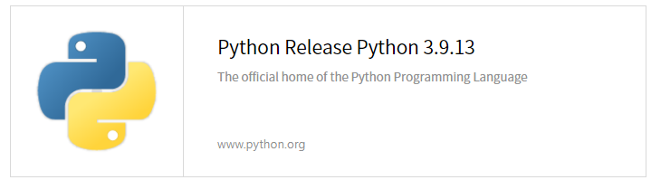

# PYTHON 

### ABOUT PYTHON 

------

> ### **🐲** [플랫폼에 독립적이며, 인터프리터식, 객체지향적, 동적 타이핑 대화형 언어이다. 파이썬 이라는 이름은 귀도가 좋아하는 코미디언〈Monty Python's Flying Circus〉에서 따온 것이다. 이름에서 고대시노하에 나오는 커다란 뱀을 연상하는 경우도 있겠지만, 이와는 무관하다. 다만 로고에는 뱀 두마리가 형상화 되어 있다.](https://ko.wikipedia.org/wiki/%ED%94%BC%ED%86%A4)
>
> **파이썬은 비영리의 파이썬 소프트웨어 재단이 관리하는 개방형, 공동체 기반 개발 모델을 가지고 있다. C언어로 구현된 사이썬 구현이 사실상의 표준이다. 파이썬 3.9 버전 이상부터는 64비트로 바뀌면서 32비트 컴퓨터에서 사용할 수 없다.** 
>
> **파이썬 3.9 버전 이상을 사용하려면 64비트 컴퓨터여야 한다.** 

####  📑 PYTHON 의 특징

-  동적 타이핑 (실행 시간에 자료형을 검사한다.)

*  객체의 멤버에 무제한으로 접근이 가능하다 (속성이나 전용의 메서드 훅을 만들어 제한 할 수 있다.)

* 모듈, 클래스, 객체와 같은 언어의 요소가 내부에서 접근이 가능하고 리플렉션을 이용한 기술을 쓸 수 있다. 

#### 📑 해석 프로그램의 종류 

* Cython : C 로 작성도니 인터프리터
* 스택리스 파이썬 : C 스택을 사용하지 않는 인터프리터
* 자이썬 : 자바 가상 머신용 인터프리터 / 과거에는 제이파이썬(JPython) 이라고 불렸다. 
* IronPython : NET 플랫폼용 인터프리터 
* PyPy : 파이썬으로 작성된 파이썬 인터프리터

#### 📑 PYTHON을 배워야 하는 이유 

> 파이썬이 자바를 넘어서 미 대학생들에게 프로그래밍 및 컴퓨터 공학 입문용으로 가장 널리 활용되고 있는 것으로 조사됨을 ACM이 밝혔다. 이 기관에 따르면 **상위 10컴퓨터 공학 부분 중 8곳이 상위 39 학교 중 27 곳이 코딩 교육을 위해 파이썬을 이용하고 있었다.**

✅ ACM ? 

> ACM : (Association for Computing Machinery)은 1947년에 설립된 세계 최초의 컴퓨터 분야의 학술과 교육을 목적으로 하는 각 분야 학회들의 연합체이다. 2007년 현재 전 세계에 약 83,000명의 회원이 있으며, 미국의 뉴욕 시에 본부를 두고 있다. 공식 명칭을 직역하면 '계산기 학회'가 되며 컴퓨터 학회라고 부르기도 한다. 그러나 영문 약자를 그대로 부르는 경우가 많다.

#### 📑 PYTHON 의 기능과 철학 

> 파이썬은 다양한 프로그래밍 패러다임을 지원하는 언어이다. 객체 지향 프로그래밍과 구조적 프로그래밍을 완벽하게 지원하며 함수형 프로그래밍, 관점 지향 프로그래밍 등도 주요 기능에서 지원 된다. 파이썬의 핵심 철학은 다음과 같다. 

◼️ "아름다운 게 추한 것보다 낫다." (Beautiful is better than ugly)

◼️ "명시적인 것이 암시적인 것 보다 낫다." (Explicit is better than implicit)

◼️ "단순함이 복잡함보다 낫다." (Simple is better than complex)

◼️ "복합함이 난해한 것보다 낫다." (Complex is better than complicated)

◼️ "가독성은 중요하다." (Readability counts)

### HOW TO SET UP PRROGRAM PYTHON

---------

1️⃣ **PYTHON 을 설치할 홈페이지를 방문하기**.

* [PYTHON.ORG](https://www.python.org/downloads/release/python-3913/)

2️⃣ **환경에 맞게 프로그램 파일을 다운받기**.

> 나는 윈도우 64-bit 를 다운받아 설치하였다. 

3️⃣ **파일을 다운 받았다면 설치를 해준다.**

> 1번 박스 체크 후 2번 박스 설치해주기

> python 설치하는 중

> 설치 완료

4️⃣ **윈도우 cmd로 PYTHON 버전 확인해보기.** 

`1) cmd 를 실행한다.`

`2) python --version 입력 한 후 (앞에 $ 기호 작성하지 않기)`

`3) 3.13버전 확인한다. (버전이 다를 수 있으니 참고하기)`

`4) exit 를 입력 후 cmd 나가기`

